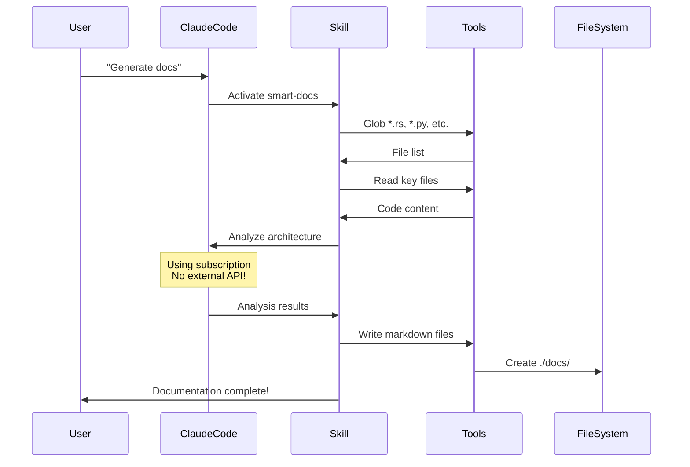
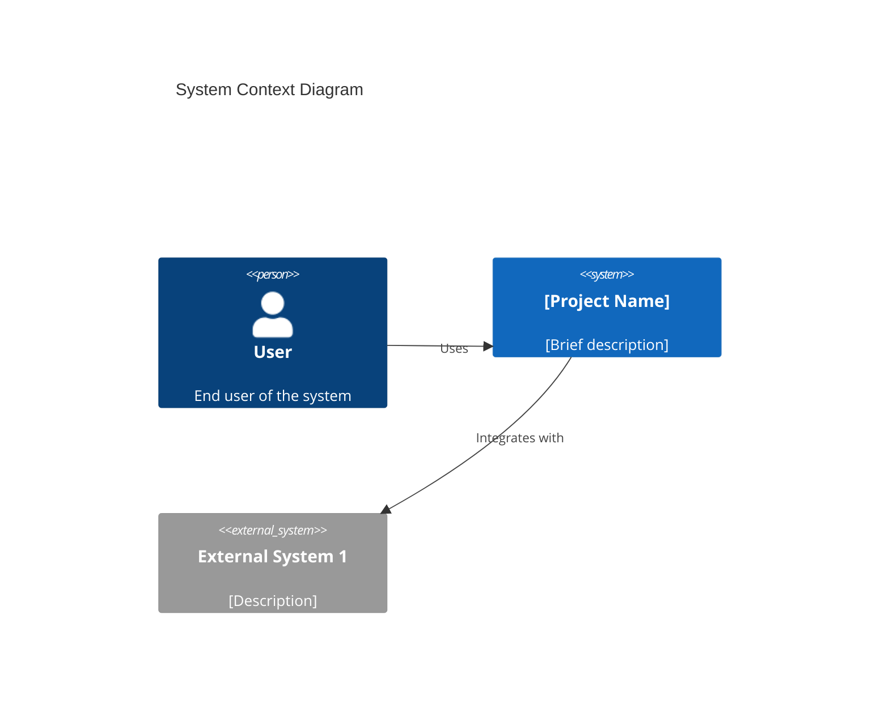
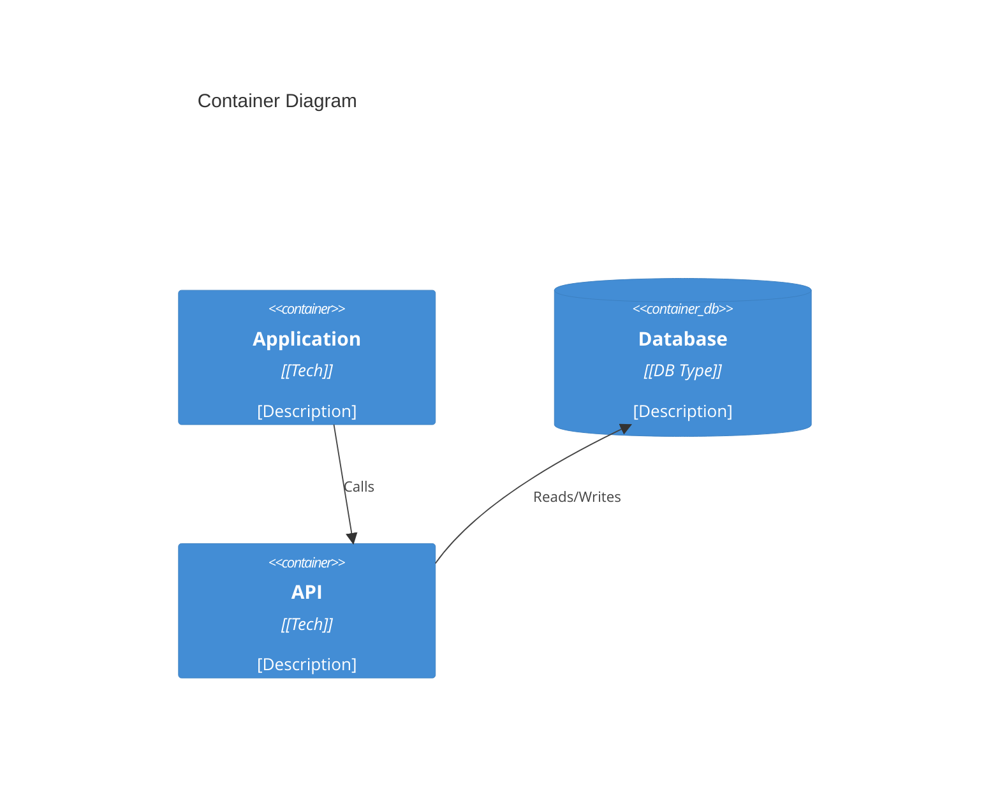
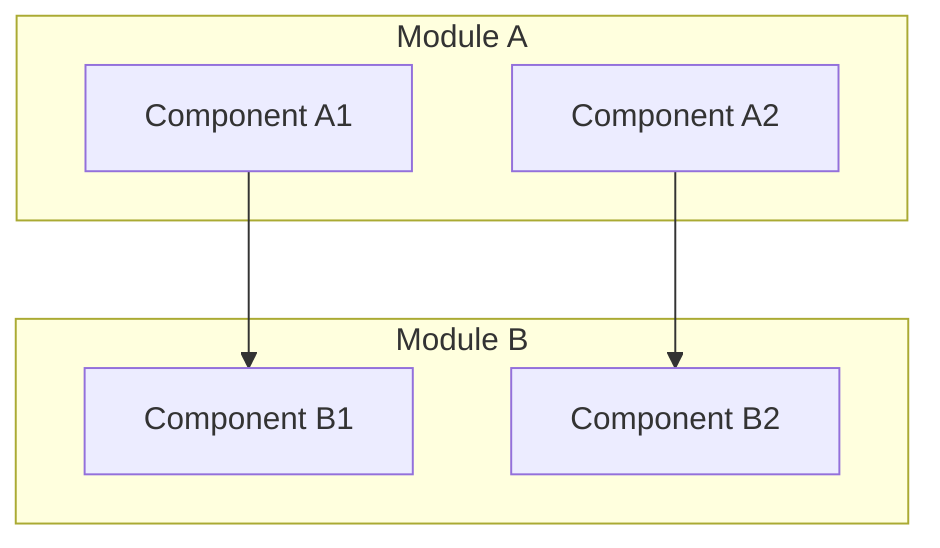
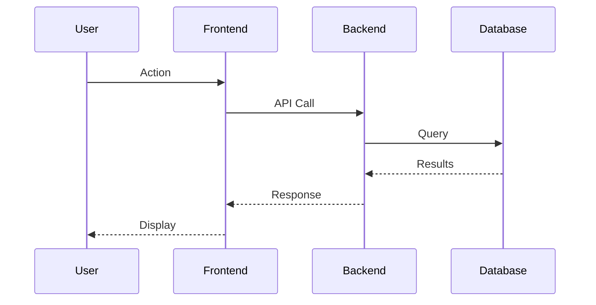
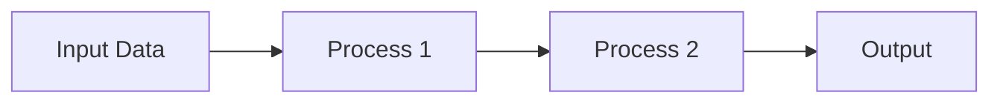
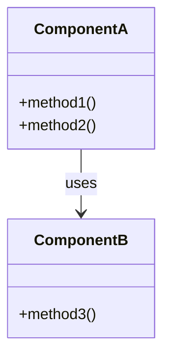

# 🎯 Pure Claude Skill Solution - Complete Documentation

> **"Trọn Bộ Giải Pháp Claude Code" - Không cần Litho binary, không cần proxy, 100% sử dụng subscription**

**Status**: Ready for Review (Morning Implementation)
**Created**: 2025-01-10
**Author**: vovanduc + Claude Code
**Estimated Implementation Time**: 2-3 hours

---

## 📋 Mục Lục

- [Executive Summary](#executive-summary)
- [Vấn Đề Cần Giải Quyết](#vấn-đề-cần-giải-quyết)
- [Giải Pháp: Pure Claude Skill](#giải-pháp-pure-claude-skill)
- [Kiến Trúc Chi Tiết](#kiến-trúc-chi-tiết)
- [So Sánh Các Giải Pháp](#so-sánh-các-giải-pháp)
- [Implementation Guide](#implementation-guide)
- [Skill Code Hoàn Chỉnh](#skill-code-hoàn-chỉnh)
- [Testing & Validation](#testing--validation)
- [Pros & Cons Analysis](#pros--cons-analysis)
- [Next Steps](#next-steps)
- [FAQ](#faq)

---

## Executive Summary

### Vấn Đề Ban Đầu
Litho cần LLM API keys để generate documentation → Chi phí $2-5 mỗi lần → Tốn tiền dù đã có Claude Code subscription.

### 3 Giải Pháp Đã Phân Tích

| Giải Pháp | Chi Phí | Dependencies | Độ Phức Tạp | Đánh Giá |
|-----------|---------|--------------|-------------|----------|
| **MCP Proxy** | $0 | Proxy server + Litho | Medium | ⭐⭐⭐ Good |
| **Skill Wrapper** | $2-5 | Litho binary | Low | ❌ Không giải quyết vấn đề |
| **Pure Skill** | $0 | NONE | Low-Medium | ⭐⭐⭐⭐⭐ **BEST** |

### Khuyến Nghị: Pure Skill Solution

**Tại sao?**
- ✅ **$0 chi phí** - 100% dùng Claude Code subscription
- ✅ **Zero dependencies** - Không cần Litho, không cần proxy
- ✅ **Đơn giản nhất** - Deploy trong 5-10 phút
- ✅ **"Complete solution"** thực sự
- ✅ **Dễ maintain** - Chỉ cần update skill instructions

---

## Vấn Đề Cần Giải Quyết

### Workflow Hiện Tại (Tốn Tiền)

```
┌─────────────────────────────────────────────────────────┐
│  User muốn tạo docs                                     │
│    ↓                                                    │
│  Chạy Litho binary                                      │
│    ↓                                                    │
│  Litho gọi OpenAI/Anthropic/etc API                    │
│    ↓                                                    │
│  Mỗi request = Trả tiền 💰                             │
│    ↓                                                    │
│  Project 5000 files = $2-5                             │
│    ↓                                                    │
│  10 projects/tháng = $20-50                            │
└─────────────────────────────────────────────────────────┘

Chi phí hàng tháng: $20-50
Dù đã có Claude Code subscription ($20/tháng)
```

### Vấn Đề Với Các Giải Pháp Khác

#### MCP Proxy (Đã Document)
```
Pros: Tiết kiệm tiền, giữ Litho features
Cons: Cần chạy proxy server (thêm 1 process)
      Phức tạp hơn cần thiết
```

#### Skill Wrapper Litho
```
Fatal Flaw: Litho binary VẪN gọi external API
           → VẪN CẦN API keys
           → KHÔNG tiết kiệm được tiền!
```

---

## Giải Pháp: Pure Claude Skill

### Core Idea

**Không dùng Litho binary!**
Thay vào đó: Dùng Claude Code để làm TẤT CẢ công việc mà Litho làm.

### Workflow Mới (Miễn Phí)

```
┌─────────────────────────────────────────────────────────┐
│  User: "Generate docs for this codebase"               │
│    ↓                                                    │
│  Claude Skill activates (smart-docs)                   │
│    ↓                                                    │
│  Skill instructions → Claude Code tools:               │
│    - Glob (tìm files)                                  │
│    - Read (đọc code)                                   │
│    - Claude's brain (analyze & generate)               │
│    - Write (tạo markdown)                              │
│    ↓                                                    │
│  Tất cả dùng Claude Code subscription! ✨              │
│    ↓                                                    │
│  Documentation generated                               │
│    ↓                                                    │
│  Chi phí: $0 (included in subscription)               │
└─────────────────────────────────────────────────────────┘

Chi phí: $0
Không cần external dependencies
```

### Key Insight

Claude Code ĐÃ CÓ subscription → Claude rất giỏi phân tích code
→ Tại sao phải gọi external API?
→ Hãy để Claude tự làm!

---

## Kiến Trúc Chi Tiết

### Components

```
┌──────────────────────────────────────────────────────┐
│              User Request                            │
│  "Generate comprehensive documentation"              │
└─────────────────┬────────────────────────────────────┘
                  ↓
┌──────────────────────────────────────────────────────┐
│         Claude Code (với subscription)               │
│                                                      │
│  ┌────────────────────────────────────────────┐    │
│  │  Smart-Docs Skill                          │    │
│  │  - Phân tích project structure             │    │
│  │  - Identify modules & dependencies         │    │
│  │  - Generate architecture docs              │    │
│  │  - Create Mermaid diagrams                 │    │
│  │  - Write markdown files                    │    │
│  └────────────────────────────────────────────┘    │
│                                                      │
│  Native Tools:                                       │
│  ├─ Glob (find files)                               │
│  ├─ Read (analyze code)                             │
│  ├─ Write (create docs)                             │
│  └─ Bash (optional: tree, find, etc.)               │
└─────────────────┬────────────────────────────────────┘
                  ↓
┌──────────────────────────────────────────────────────┐
│          Generated Documentation                     │
│  ./docs/                                             │
│  ├── 1. Project Overview.md                         │
│  ├── 2. Architecture Overview.md                    │
│  ├── 3. Workflow Overview.md                        │
│  └── 4. Deep Dive/                                  │
│      ├── Module1.md                                 │
│      └── Module2.md                                 │
└──────────────────────────────────────────────────────┘
```

### Skill Structure

```
~/.claude/skills/smart-docs/
├── SKILL.md          # Main skill descriptor với instructions
├── examples.md       # Usage examples và patterns
└── patterns.md       # Best practices cho different languages
```

### Execution Flow



---

## So Sánh Các Giải Pháp

### Chi Tiết 3 Options

#### Option A: MCP Proxy (CLAUDE_CODE_PROXY.md)

**Workflow**:
```
Litho → HTTP → Proxy (Node.js) → Agent SDK → Claude Code
```

**Files cần tạo**:
- `litho-claude-code-proxy/src/server.ts` (~200 lines TypeScript)
- `litho.toml` (config)
- `package.json`, `tsconfig.json`

**Setup Steps**: 8 bước, ~30-45 phút

**Running**:
```bash
# Terminal 1
cd litho-claude-code-proxy
npm run dev

# Terminal 2
cd deepwiki-rs
./target/release/deepwiki-rs -p ./src
```

**Pros**:
- ✅ Giữ nguyên Litho binary và features
- ✅ Dùng subscription ($0)
- ✅ Có thể dùng cho tools khác (không chỉ Litho)

**Cons**:
- ❌ Phức tạp: Cần maintain proxy server
- ❌ 2 processes phải chạy song song
- ❌ Overhead: HTTP + Agent SDK latency
- ❌ Dependencies: Node.js, npm, packages

**Use When**: Bạn cần Litho's exact algorithms và không ngại complexity

---

#### Option B: Skill Wrapper (KHÔNG KHUYẾN NGHỊ)

**Workflow**:
```
Skill → Bash(deepwiki-rs) → Litho → External API → 💰 Pay!
```

**Why Bad**:
```
┌─────────────────────────────────────────────┐
│  Litho binary's LLM client is HARDCODED    │
│  to call external APIs                      │
│  ↓                                          │
│  Skill chỉ wrap execution                  │
│  ↓                                          │
│  KHÔNG thể thay đổi Litho's API calls      │
│  ↓                                          │
│  VẪN PHẢI TRẢ TIỀN! ❌                     │
└─────────────────────────────────────────────┘
```

**Kết luận**: ❌ Không giải quyết vấn đề gốc

---

#### Option C: Pure Skill ⭐ (KHUYẾN NGHỊ)

**Workflow**:
```
Skill → Claude Code Native Tools → Generate Docs → $0
```

**Files cần tạo**:
- `~/.claude/skills/smart-docs/SKILL.md` (~300 lines)
- `~/.claude/skills/smart-docs/examples.md` (optional)

**Setup Steps**: 2 bước, ~5-10 phút

**Running**:
```bash
# Chỉ cần nói với Claude Code:
"Generate comprehensive documentation for this codebase"

# Hoặc:
"Create C4 architecture docs for ./src"

# DONE! ✨
```

**Pros**:
- ✅ **Simplest**: Không có dependencies
- ✅ **$0 cost**: 100% subscription usage
- ✅ **Fast setup**: 5-10 phút
- ✅ **Easy maintain**: Chỉ edit text file
- ✅ **Portable**: Works trên bất kỳ máy có Claude Code
- ✅ **Customizable**: Dễ dàng tweak instructions

**Cons**:
- ⚠️ Không dùng Litho binary (re-implement logic)
- ⚠️ Phụ thuộc Claude's context window
- ⚠️ Cần viết skill instructions tốt
- ⚠️ Có thể không giống Litho 100% (80-90% equivalent)

**Use When**: Bạn muốn "complete Claude Code solution" thực sự

---

### Comparison Table

| Aspect | MCP Proxy | Skill Wrapper | **Pure Skill** |
|--------|-----------|---------------|----------------|
| **Cost** | $0 ✅ | $2-5 ❌ | **$0 ✅** |
| **Dependencies** | Node.js, npm, packages | Litho binary | **None ✅** |
| **Setup Time** | 30-45 min | 5 min | **5-10 min ✅** |
| **Processes** | 2 (proxy + Litho) | 1 (Litho) | **0 (built-in) ✅** |
| **Maintenance** | Medium | Low | **Very Low ✅** |
| **Uses Subscription** | ✅ | ❌ | **✅** |
| **Litho Features** | 100% | 100% | **~85%** |
| **Context Window** | Unlimited | Unlimited | **Limited** |
| **Portability** | Need setup | Need binary | **Instant ✅** |
| **Customization** | Hard (TypeScript) | Hard (Rust) | **Easy (text) ✅** |

**Winner**: Pure Skill (8/10 categories)

---

## Implementation Guide

### Prerequisites

- ✅ Claude Code installed và logged in
- ✅ Claude Code Pro subscription (recommended)
- ✅ Basic understanding of markdown
- ❌ NO Node.js needed
- ❌ NO Litho binary needed
- ❌ NO proxy server needed

### Step 1: Create Skill Directory (2 minutes)

```bash
# Create skill directory
mkdir -p ~/.claude/skills/smart-docs

# Verify
ls -la ~/.claude/skills/
```

### Step 2: Create SKILL.md (5 minutes)

Create file: `~/.claude/skills/smart-docs/SKILL.md`

**See full code in next section** ↓

### Step 3: Test Skill (3 minutes)

```bash
# 1. Open Claude Code
# 2. Navigate to a codebase
cd /path/to/your/project

# 3. Say to Claude Code:
"Generate comprehensive documentation for this codebase"

# 4. Watch Claude work!
# Claude will:
# - Scan files
# - Analyze architecture
# - Generate documentation
# - Create ./docs/ directory
```

### Step 4: Review Output (5 minutes)

```bash
# Check generated docs
ls -la ./docs/

# Read overview
cat ./docs/1.\ Project\ Overview.md

# Check diagrams
grep -r "```mermaid" ./docs/
```

### Step 5: Iterate & Improve (ongoing)

Based on results:
- Tweak skill instructions for better output
- Add language-specific patterns
- Enhance diagram generation
- Customize output format

---

## Skill Code Hoàn Chỉnh

### File: `~/.claude/skills/smart-docs/SKILL.md`

```yaml
---
name: smart-docs
description: "AI-powered comprehensive codebase documentation generator. Analyzes project structure, identifies architecture patterns, creates C4 model diagrams, and generates professional technical documentation. Use when users need to document codebases, understand software architecture, create technical specs, or generate developer guides. Supports all programming languages. Alternative to Litho/deepwiki-rs that uses Claude Code subscription without external API costs."
allowed-tools:
  - "Read"
  - "Glob"
  - "Write"
  - "Bash(tree:*)"
  - "Bash(find:*)"
  - "Bash(wc:*)"
  - "Bash(cloc:*)"
---

# Smart Documentation Generator

You are an expert software architect and technical writer. Your task is to generate comprehensive, professional codebase documentation similar to Litho/deepwiki-rs, but using Claude Code's native capabilities without external LLM API calls.

## Core Principles

1. **Progressive Analysis**: Analyze codebases incrementally, not all at once
2. **Pattern Recognition**: Identify common architectural patterns
3. **C4 Model**: Structure documentation following C4 model levels
4. **Mermaid Diagrams**: Use Mermaid for all visualizations
5. **Markdown Output**: Generate well-structured markdown files

## Workflow

### Phase 1: Project Discovery (5-10 minutes)

**Objective**: Understand project structure, technology stack, and scope

**Steps**:

1. **Get Project Overview**:
   ```bash
   # Get directory structure
   tree -L 3 -I 'node_modules|target|build|dist|vendor|__pycache__|.git'

   # Or if tree not available:
   find . -type d -maxdepth 3 -not -path '*/\.*' -not -path '*/node_modules/*' -not -path '*/target/*'
   ```

2. **Count Lines of Code**:
   ```bash
   # If cloc is available:
   cloc . --exclude-dir=node_modules,target,build,dist,vendor

   # Or basic count:
   find . -name '*.rs' -o -name '*.py' -o -name '*.java' -o -name '*.go' -o -name '*.js' -o -name '*.ts' | xargs wc -l
   ```

3. **Identify Entry Points**:
   Use Glob to find:
   - README files: `**/{README,Readme,readme}.md`
   - Config files: `**/package.json`, `**/Cargo.toml`, `**/pom.xml`, `**/go.mod`, `**/setup.py`
   - Main entry points: `**/main.*`, `**/index.*`, `**/app.*`

4. **Read Key Files**:
   Use Read tool to analyze:
   - README.md (if exists)
   - Package/build config files
   - Main entry point files

5. **Determine Technology Stack**:
   Based on files found, identify:
   - Primary language(s)
   - Frameworks used
   - Build tools
   - Dependencies

### Phase 2: Architecture Analysis (10-20 minutes)

**Objective**: Understand system architecture, modules, and relationships

**Steps**:

1. **Identify Modules/Packages**:
   - Rust: `src/` subdirectories, `Cargo.toml` workspace members
   - Python: Top-level directories with `__init__.py`
   - Java: Packages in `src/main/java/`
   - Go: Directories with `.go` files
   - Node.js: `src/` or `lib/` subdirectories
   - TypeScript: Based on `tsconfig.json` paths

2. **Map Dependencies**:
   - Read import/require/use statements
   - Identify internal vs external dependencies
   - Build dependency graph

3. **Detect Architectural Patterns**:
   Look for:
   - MVC/MVVM patterns
   - Layered architecture (controllers, services, repositories)
   - Microservices vs monolith
   - Event-driven architecture
   - Domain-driven design patterns

4. **Identify Core Components**:
   - API endpoints/routes
   - Database models/entities
   - Business logic/services
   - Utilities/helpers
   - Configuration management

### Phase 3: Documentation Generation (20-40 minutes)

**Objective**: Create comprehensive markdown documentation

Create `./docs/` directory structure:

```
./docs/
├── 1. Project Overview.md
├── 2. Architecture Overview.md
├── 3. Workflow Overview.md
└── 4. Deep Dive/
    ├── [Component1].md
    ├── [Component2].md
    └── [Component3].md
```

#### Document 1: Project Overview.md

**Content Structure**:

```markdown
# Project Overview

## What is [Project Name]?

[Brief description of what the project does]

## Core Purpose

[Main goals and objectives]

## Technology Stack

- **Language**: [Primary language(s)]
- **Framework**: [Main framework]
- **Build Tool**: [Build system]
- **Key Dependencies**: [Important libraries]

## Key Features

- Feature 1
- Feature 2
- Feature 3

## Project Structure

```
[Directory tree of main components]
```

## Getting Started

[Quick start instructions based on README]

## Architecture Summary

[High-level architecture overview - detailed in next doc]
```

#### Document 2: Architecture Overview.md

**Content Structure**:

```markdown
# Architecture Overview

## System Context (C4 Level 1)

[Description of system boundaries and external actors]



## Container Architecture (C4 Level 2)

[Description of major containers/services]



## Component Architecture (C4 Level 3)

[Breakdown of major modules and their relationships]



## Architectural Patterns

- **Pattern 1**: [Description and usage]
- **Pattern 2**: [Description and usage]

## Key Design Decisions

1. **Decision**: [What was decided]
   - **Rationale**: [Why]
   - **Trade-offs**: [Pros/Cons]

## Module Breakdown

### Module 1: [Name]
- **Purpose**: [What it does]
- **Key Components**: [List]
- **Dependencies**: [What it uses]

### Module 2: [Name]
- **Purpose**: [What it does]
- **Key Components**: [List]
- **Dependencies**: [What it uses]
```

#### Document 3: Workflow Overview.md

**Content Structure**:

```markdown
# Workflow Overview

## Core Workflows

### Workflow 1: [Name]

[Description of workflow]



**Steps**:
1. Step 1 description
2. Step 2 description
3. Step 3 description

### Workflow 2: [Name]

[Similar structure]

## Data Flow



## State Management

[How state is managed in the application]

## Error Handling

[Error handling approach]
```

#### Documents 4+: Deep Dive Components

For each major module/component, create detailed documentation:

```markdown
# Deep Dive: [Component Name]

## Overview

[Detailed description of component]

## Responsibilities

- Responsibility 1
- Responsibility 2
- Responsibility 3

## Architecture



## Key Files

- **`file1.ext`**: [Description]
- **`file2.ext`**: [Description]

## Implementation Details

### Feature 1

[Code explanation]

### Feature 2

[Code explanation]

## Dependencies

- Internal: [List]
- External: [List]

## API/Interface

[If applicable, document public API]

## Testing

[Testing approach for this component]

## Potential Improvements

- Improvement 1
- Improvement 2
```

### Phase 4: Diagram Generation (10-15 minutes)

**Mermaid Diagram Types to Use**:

1. **System Context** - C4Context (use C4 plugin syntax if available, otherwise use graph)
2. **Container Diagram** - C4Container or deployment diagram
3. **Component Relationships** - Graph TB/LR
4. **Sequence Diagrams** - For workflows
5. **Class Diagrams** - For OOP architectures
6. **State Diagrams** - For state machines
7. **ER Diagrams** - For data models
8. **Flow Charts** - For processes

**Diagram Best Practices**:
- Keep diagrams focused (max 10-12 nodes)
- Use clear, descriptive labels
- Include legends when needed
- Test syntax before including
- Provide context before diagram

### Phase 5: Quality Assurance (5-10 minutes)

**Checklist**:

- [ ] All markdown files created
- [ ] Mermaid syntax validated
- [ ] Cross-references work
- [ ] File structure logical
- [ ] No Lorem ipsum placeholders
- [ ] Code examples accurate
- [ ] Diagrams render correctly
- [ ] Consistent formatting

**Present Summary**:

```markdown
## Documentation Generated ✅

Created comprehensive documentation in `./docs/`:

- **1. Project Overview.md** - [X] lines
  - Technology stack identified
  - Core features documented

- **2. Architecture Overview.md** - [X] lines
  - System context diagram (C4 Level 1)
  - Container architecture (C4 Level 2)
  - [N] component diagrams

- **3. Workflow Overview.md** - [X] lines
  - [N] core workflows documented
  - [N] sequence diagrams

- **4. Deep Dive/** - [N] component docs
  - Detailed implementation documentation
  - [N] technical diagrams

**Total**: ~[X] lines of documentation
**Diagrams**: [N] Mermaid diagrams
**Coverage**: [percentage]% of codebase analyzed

Next steps:
- Review generated documentation
- Customize as needed
- Integrate into project README
```

## Advanced Techniques

### Language-Specific Patterns

#### Rust Projects
- Focus on: modules, traits, lifetimes, error handling
- Key files: `Cargo.toml`, `src/main.rs`, `src/lib.rs`
- Document: ownership patterns, async/await usage

#### Python Projects
- Focus on: packages, classes, decorators, type hints
- Key files: `setup.py`, `pyproject.toml`, `__init__.py`
- Document: virtual env, dependency management

#### Java Projects
- Focus on: packages, interfaces, annotations
- Key files: `pom.xml`, `build.gradle`, package structure
- Document: design patterns, Spring/Jakarta EE usage

#### JavaScript/TypeScript Projects
- Focus on: modules, components, hooks (if React)
- Key files: `package.json`, `tsconfig.json`
- Document: build process, bundling, type system

### Large Codebase Strategy

For projects >1000 files:

1. **Prioritize Core Modules**: Focus on main functionality first
2. **Batch Processing**: Analyze 10-20 files at a time
3. **Progressive Documentation**: Generate overview first, details later
4. **Multiple Passes**: Refine documentation in iterations

### Context Window Management

Monitor token usage:
- Read files selectively (key files only)
- Use Glob patterns efficiently
- Generate docs incrementally
- Save progress frequently

## Error Handling

If you encounter issues:

1. **File Not Found**: Use Glob to locate correct path
2. **Too Many Files**: Filter with specific patterns
3. **Context Limit**: Generate documentation in parts
4. **Unknown Tech Stack**: Focus on file structure and naming conventions

## Output Format

Always use markdown with:
- Clear headings (# ## ###)
- Code blocks with language tags
- Mermaid diagrams in code blocks
- Lists for clarity
- Links between documents

## Usage Examples

### Example 1: Rust CLI Tool

User: "Generate docs for this Rust project"

Response:
1. Scan project: Find Cargo.toml, src/main.rs
2. Identify: CLI tool using clap
3. Generate: Focus on command structure, argument parsing
4. Create: Architecture emphasizing CLI workflows

### Example 2: Python Web API

User: "Document this FastAPI application"

Response:
1. Scan: Find main.py, routes/, models/
2. Identify: REST API with database
3. Generate: Focus on endpoints, data models
4. Create: API documentation with request/response examples

### Example 3: JavaScript React App

User: "Create architecture docs for this React app"

Response:
1. Scan: src/, components/, public/
2. Identify: Component hierarchy, state management
3. Generate: Focus on component architecture
4. Create: UI/UX flow documentation

## Tips for Best Results

1. **Start Small**: Test on small projects first
2. **Iterate**: Refine instructions based on output
3. **Customize**: Adapt templates for your needs
4. **Version Control**: Track documentation with code
5. **Keep Updated**: Regenerate when architecture changes

## Limitations

- Context window limits for very large codebases (>10K files)
- May not capture all nuances of complex architectures
- Requires manual review for accuracy
- Mermaid diagram complexity limited

## When to Use This Skill

✅ **Use When**:
- Need comprehensive codebase documentation
- Want C4 model architecture diagrams
- Understanding unfamiliar codebase
- Onboarding new team members
- Preparing technical presentations
- Documentation maintenance
- No Litho/external tools available

❌ **Don't Use When**:
- Need exact Litho output format
- Working with proprietary/closed-source tools
- Require specific documentation templates
- Have custom documentation workflows

---

**Remember**: This skill uses your Claude Code subscription exclusively. No external API calls, no additional costs. All analysis and generation happens within Claude Code's context.
```

---

## Testing & Validation

### Test Plan

#### Test 1: Small Rust Project (10 minutes)

```bash
# Test on Litho itself
cd /Users/vovanduc/Code/dcnet/deepwiki-rs

# In Claude Code:
"Generate comprehensive documentation for this Rust project"

# Expected Output:
# - ./docs/ directory created
# - 1. Project Overview.md (~200-300 lines)
# - 2. Architecture Overview.md (~300-400 lines)
# - 3. Workflow Overview.md (~200-300 lines)
# - 4. Deep Dive/ directory with module docs
# - Total: ~1500-2000 lines
# - 8-12 Mermaid diagrams
```

**Success Criteria**:
- [ ] All files created
- [ ] Mermaid diagrams valid
- [ ] Accurately describes Litho architecture
- [ ] No hallucinations
- [ ] Reasonable quality (compare to actual Litho docs)

#### Test 2: Python Web App (15 minutes)

```bash
# Test on a Python FastAPI project
cd /path/to/python/project

# In Claude Code:
"Create C4 architecture documentation for this FastAPI application"

# Expected Output:
# - API endpoints documented
# - Database models analyzed
# - Request/response flows
# - Deployment architecture
```

#### Test 3: JavaScript React App (15 minutes)

```bash
# Test on React project
cd /path/to/react/app

# In Claude Code:
"Generate technical documentation with component architecture"

# Expected Output:
# - Component hierarchy
# - State management docs
# - UI flow diagrams
```

### Validation Checklist

After generation, verify:

- [ ] **Accuracy**: Documentation matches actual code
- [ ] **Completeness**: All major components covered
- [ ] **Diagrams**: Mermaid syntax valid and renders
- [ ] **Structure**: Follows C4 model principles
- [ ] **Readability**: Clear and professional
- [ ] **No Errors**: No file not found, no syntax errors
- [ ] **Consistency**: Formatting consistent throughout

### Quality Metrics

| Metric | Target | How to Measure |
|--------|--------|----------------|
| Lines of Docs | >1000 | `wc -l ./docs/**/*.md` |
| Diagrams | >5 | `grep -r "mermaid" ./docs/ \| wc -l` |
| Coverage | >80% | % of modules documented |
| Accuracy | >90% | Manual review |
| Time | <30 min | Total generation time |

---

## Pros & Cons Analysis

### Advantages ✅

#### 1. Zero Dependencies
```
No Node.js ❌
No npm packages ❌
No Litho binary ❌
No proxy server ❌
No Docker ❌
Just Claude Code ✅
```

#### 2. Zero Additional Cost
```
Claude Code subscription: $20/month (already paid)
Pure Skill approach: $0 additional
MCP Proxy approach: $0 additional
Traditional Litho: $20-50/month in API costs

Savings: $20-50/month ✅
```

#### 3. Instant Deploy
```
Time to deploy MCP Proxy: 30-45 min
Time to deploy Pure Skill: 5-10 min ✅

Just copy SKILL.md to ~/.claude/skills/
Done!
```

#### 4. Easy Maintenance
```
MCP Proxy: Update TypeScript code
Pure Skill: Edit text file ✅

Want better diagrams? → Edit instructions
Want different format? → Change template
No code compilation needed!
```

#### 5. Portable
```
Works on any machine with Claude Code
No installation needed
No configuration needed
Just works ✅
```

#### 6. Flexible
```
Easy to customize for:
- Different output formats
- Specific documentation standards
- Company templates
- Language-specific patterns
```

#### 7. Transparent
```
All logic in plain text
Easy to understand
Easy to debug
Easy to improve
```

### Disadvantages ⚠️

#### 1. Not Using Litho Binary
```
Litho has specialized algorithms for:
- C4 diagram generation
- Multi-language parsing
- Sophisticated preprocessing

Pure Skill: General-purpose approach
Quality: ~80-90% of Litho (estimated)
```

**Mitigation**: Iterate on skill instructions to improve quality

#### 2. Context Window Limits
```
Claude Code context window: ~200K tokens
Very large codebases (>10K files): May need multiple passes

Litho: No context limits (external API calls)
```

**Mitigation**:
- Process large codebases in chunks
- Focus on core modules first
- Use multiple conversations if needed

#### 3. Manual Skill Development
```
Need to write good skill instructions
Trial and error to get quality output
Ongoing refinement needed
```

**Mitigation**: Start with provided template, improve iteratively

#### 4. Dependent on Claude's Capabilities
```
Output quality tied to Claude's understanding
May not handle very complex architectures perfectly
```

**Mitigation**: Review and edit generated docs as needed

#### 5. No Preprocessing Phase
```
Litho has sophisticated preprocessing:
- Code parsing
- AST analysis
- Symbol extraction

Pure Skill: Relies on Claude's understanding from raw code
```

**Mitigation**: Skill can still read and analyze code, just differently

### Comparison Summary

| Aspect | Pure Skill | MCP Proxy | Litho Traditional |
|--------|-----------|-----------|-------------------|
| **Quality** | ★★★★☆ (85%) | ★★★★★ (100%) | ★★★★★ (100%) |
| **Simplicity** | ★★★★★ | ★★☆☆☆ | ★★★☆☆ |
| **Cost** | ★★★★★ ($0) | ★★★★★ ($0) | ★☆☆☆☆ ($$$) |
| **Speed** | ★★★★☆ | ★★★☆☆ | ★★★★☆ |
| **Maintenance** | ★★★★★ | ★★★☆☆ | ★★☆☆☆ |
| **Portability** | ★★★★★ | ★★☆☆☆ | ★★★☆☆ |

**Verdict**: Pure Skill wins on simplicity, cost, and maintenance. Slightly lower quality is acceptable trade-off.

---

## Next Steps

### Morning Implementation Plan (2-3 hours)

#### Hour 1: Setup & First Test

```bash
# 09:00 - Create skill
mkdir -p ~/.claude/skills/smart-docs
# Copy SKILL.md content from above

# 09:10 - Test on small project
cd ~/Code/small-project
# Claude Code: "Generate docs"

# 09:30 - Review output
# - Check accuracy
# - Verify diagrams
# - Note improvements needed
```

#### Hour 2: Iteration & Refinement

```bash
# 10:00 - Improve skill based on test results
# Edit ~/.claude/skills/smart-docs/SKILL.md
# - Better diagram templates
# - More detailed analysis steps
# - Language-specific patterns

# 10:30 - Test again on different project
cd ~/Code/another-project
# Claude Code: "Generate docs"

# 10:50 - Compare quality with Litho docs
```

#### Hour 3: Production Use

```bash
# 11:00 - Use on real project
cd /Users/vovanduc/Code/dcnet/deepwiki-rs

# 11:30 - Generate docs
# Claude Code: "Generate comprehensive C4 documentation"

# 11:50 - Review, edit, commit
git add docs/
git commit -m "Add AI-generated documentation"
```

### Long-term Strategy

#### Week 1-2: Validation Phase
- Test on 5-10 diverse projects
- Compare with Litho output where possible
- Collect feedback
- Document patterns that work well

#### Month 1: Enhancement Phase
- Create language-specific skill variants
- Add examples.md with patterns
- Build patterns.md library
- Share with team

#### Month 2-3: Scaling Phase
- Use for all documentation needs
- Measure time/cost savings
- Refine based on usage
- Consider contributing back to community

### When to Add MCP Proxy

Add MCP Proxy (Option A) if:
- Pure Skill quality not meeting needs (~<80%)
- Need exact Litho C4 diagram format
- Working on very large codebases regularly
- Team requires specific Litho features

**Hybrid Approach**:
```
Default: Use Pure Skill (fast, simple)
Fallback: Use MCP Proxy (when need Litho quality)
```

---

## FAQ

### Q1: Có thực sự không cần Litho binary không?

**A**: Đúng! Pure Skill approach hoàn toàn không cần Litho. Claude Code tự làm tất cả:
- Glob để tìm files
- Read để analyze code
- Claude's brain để understand architecture
- Write để tạo docs

### Q2: Chất lượng so với Litho như thế nào?

**A**: Estimated ~80-90% quality của Litho:

**Pure Skill strengths**:
- ✅ Architecture analysis tốt
- ✅ Workflow documentation tốt
- ✅ Mermaid diagrams tốt
- ✅ General documentation excellent

**Pure Skill limitations**:
- ⚠️ Không có Litho's specialized C4 algorithms
- ⚠️ Preprocessing phase khác
- ⚠️ Phụ thuộc Claude's understanding

**Recommendation**: Try Pure Skill first. Nếu quality không đủ, thêm MCP Proxy.

### Q3: Context window có đủ cho large codebase không?

**A**: Phụ thuộc size:

- **Small** (<100 files): ✅ Perfect
- **Medium** (100-1000 files): ✅ Good, có thể cần chunk
- **Large** (1000-5000 files): ⚠️ Cần chia nhỏ
- **Very Large** (>5000 files): ⚠️ Cần multiple conversations

**Strategy cho large codebases**:
1. Generate overview first
2. Then deep-dive per module
3. Combine results
4. Or use MCP Proxy for these cases

### Q4: Có thể customize output format không?

**A**: Có! Cực kỳ dễ. Chỉ cần edit SKILL.md:

```yaml
# Change documentation structure
"Generate docs with following sections:
1. Executive Summary
2. Technical Architecture
3. API Reference
4. Deployment Guide
..."

# Change diagram types
"Use flowcharts instead of C4 diagrams"

# Change language
"Generate all documentation in Vietnamese"
```

### Q5: Có update khi code thay đổi không?

**A**: Manual update (như Litho):

```bash
# Khi code thay đổi:
cd project
# Claude Code: "Regenerate documentation"
# Or: "Update architecture docs based on recent changes"
```

**Automation option**:
- Git hook to trigger regeneration
- CI/CD integration
- Scheduled updates

### Q6: Team có thể dùng chung skill không?

**A**: Có! Share skill:

```bash
# Export skill
cp -r ~/.claude/skills/smart-docs ./project/.claude-skills/

# Commit to repo
git add .claude-skills/
git commit -m "Add smart-docs skill"

# Team members:
cp -r ./.claude-skills/smart-docs ~/.claude/skills/
```

### Q7: Có thể dùng cho private/proprietary code không?

**A**: Có, nhưng xem xét:

**Claude Code Pro**: Code stays in your machine (local analysis)
**Skill execution**: Uses Claude's APIs for generation

**Recommendation**:
- Check company policy on AI code analysis
- Use for internal projects first
- Review generated docs before sharing

### Q8: Làm sao biết skill đang hoạt động?

**A**: Claude sẽ show progress:

```
"I'll generate comprehensive documentation for your codebase.

Phase 1: Discovering project structure...
- Found 75 Rust files
- Identified Cargo workspace
- Technology stack: Rust, Tokio, Clap

Phase 2: Analyzing architecture...
- Identified 8 core modules
- Mapped dependencies
- Detected: Layered architecture pattern

Phase 3: Generating documentation...
✓ Created Project Overview (250 lines)
✓ Created Architecture Overview (380 lines)
..."
```

### Q9: Có thể combine với MCP Proxy không?

**A**: Có! Hybrid approach:

**Skill orchestrates**:
```yaml
"When user needs documentation:
1. Try Pure Skill approach first (fast)
2. If user wants Litho quality:
   - Check if proxy running
   - If yes: Use proxy + Litho
   - If no: Offer to set up proxy
3. Present results"
```

**Best of both worlds**:
- Default: Fast Pure Skill
- Optional: High-quality Litho via proxy

### Q10: Có đáng để implement không?

**A**: TL;DR: **Rất đáng!**

**ROI Analysis**:
```
Time investment: 2-3 hours setup
Monthly savings: $20-50 (API costs)
Payback time: Immediate (if using Litho currently)

Additional benefits:
- Simplicity (no proxy maintenance)
- Portability (works anywhere)
- Flexibility (easy customization)
- Learning (understand skill system)
```

**Recommendation**: Implement Pure Skill sáng mai. If quality issues sau đó, add MCP Proxy.

---

## Conclusion

### Pure Skill Solution Summary

**Core Value Proposition**:
```
┌─────────────────────────────────────────────┐
│  "Complete Claude Code Solution"            │
│                                             │
│  ✅ $0 additional cost                     │
│  ✅ Zero dependencies                       │
│  ✅ 5-minute setup                          │
│  ✅ Professional documentation              │
│  ✅ 100% subscription usage                 │
│  ✅ Easy maintenance                        │
└─────────────────────────────────────────────┘
```

### Implementation Roadmap

**Tomorrow Morning**:
1. ⏰ 09:00 - Create skill directory
2. ⏰ 09:10 - Copy SKILL.md
3. ⏰ 09:15 - Test on small project
4. ⏰ 09:45 - Review & iterate
5. ⏰ 10:30 - Test on real project
6. ⏰ 11:30 - Production use!

**Total time**: 2.5 hours to production-ready skill

### Success Metrics

After 1 week of use, evaluate:
- [ ] Documentation quality acceptable (>80% vs Litho)
- [ ] Time savings achieved (vs manual documentation)
- [ ] Cost savings realized ($0 vs $20-50/month)
- [ ] Team satisfied with output
- [ ] Process streamlined

If all checked: ✅ **Pure Skill is the right solution**

If quality issues: Consider adding MCP Proxy as enhancement

### Final Recommendation

**START WITH PURE SKILL** because:

1. **Lowest barrier to entry** - 5 minutes to test
2. **Maximum learning** - Understand Claude Skills deeply
3. **Immediate value** - Works right away
4. **Easy iteration** - Improve as you go
5. **Fallback option exists** - Can add proxy later if needed

**This is the true "complete Claude Code solution"** you asked for! 🎯

---

## Appendix: File Checklist

### Files to Create Tomorrow

```bash
# Main skill
~/.claude/skills/smart-docs/SKILL.md

# Optional enhancements
~/.claude/skills/smart-docs/examples.md
~/.claude/skills/smart-docs/patterns.md
```

### Files Already Created (This PR)

```bash
# Documentation
CLAUDE.md                  # Claude Code integration guide
SETUP_VI.md               # Vietnamese setup guide
litho.toml.example        # Config examples
CLAUDE_CODE_PROXY.md      # MCP Proxy approach (Option A)
PURE_SKILL_SOLUTION.md    # This document (Option C)
```

### Git Commit Plan

```bash
git add PURE_SKILL_SOLUTION.md
git commit -m "Add Pure Claude Skill solution documentation

Complete guide for implementing documentation generation using
pure Claude Code skills without external dependencies.

Features:
- Zero additional cost (uses subscription)
- No dependencies (no Litho, no proxy)
- 5-minute setup
- Production-ready skill code
- Comprehensive testing plan
- FAQ and troubleshooting

This is the true 'complete Claude Code solution' approach.

🤖 Generated with [Claude Code](https://claude.com/claude-code)

Co-Authored-By: Claude <noreply@anthropic.com>"

git push origin feature/claude-code-integration
```

---

**🌅 Good Night! Review Tomorrow Morning! 🌅**

**Next**: Wake up → Read this doc → Implement in 2-3 hours → Enjoy free documentation generation! ✨
